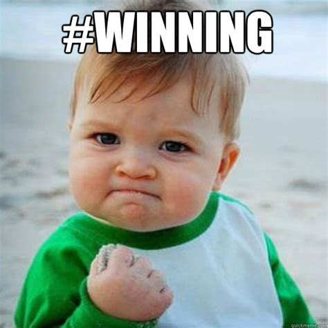
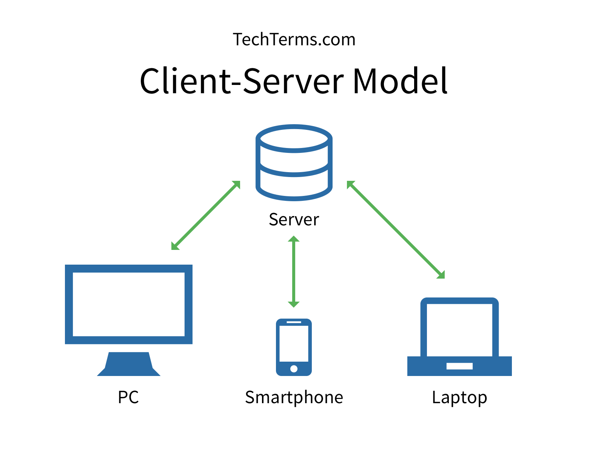
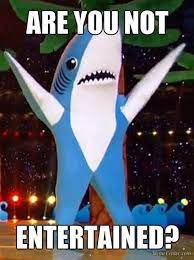

<!-- _backgroundImage: 'url(./greetings-background.png)' -->

# Introductions <!-- +5 minutes -->

* About me
  * Always wanted to build something cool (not sure if I ever succeeded before today)
  * Started programming by building iPhone apps with friends and going to hackathons
  * Currently at Meta as a Software Engineer
  * Got Repetitive Strain Injury and have been transitioning to voice coding for the past year. Prepared this presentation without touching my keyboard
* What did you learn in this class so far?
* Today we will be building a multiplayer web browser version of the game called Blink
* Lets first try playing the table version!

---

# Understanding Blink <!-- +8 minutes -->

- How does our game start? <!-- +5  minutes -->
- How do a player make a move? <!-- +5  minutes -->
- How does one win? <!-- +5  minutes -->

---

# Starting


- Split in groups of 3 or less people and sit at the table
- Each player gets a deck of 19 cards each (face down)
- 2 cards are placed face up on the table, these are `stacks`
- Get 3 cards from your deck and hold them in your `hand`

---

# Moving


- You can play a card from your `hand` to a `stack`
- **If your card matches one of the features (shape, color or count)** of the card on top of a `stack`
- Which moves can you make here?

---



- The first player to run out of cards wins
- Let's play a round!

---

# Modeling the game <!-- +15 minutes to do include pictures and code references -->

What does the minimal version of our game need?

What does our player need to play?

* Ability to create and join virtual tables
* Ability to see cards on the table - `stacks`
* Ability to see their cards - `hand`
* Ability to to make a move
* Ability to know when they won or lost

---

## What will the website 👶 look like for our game?

* Supports entering a room name and user name
* **Given information** about what `stacks` are on the table, display top cards from each stack
* Display top 3 cards from user's `hand`
* Provide someway to move a card from player's `hand` to a `stack`
* Why did I highlight **given information**?
  * Because with every move the `stack` contents change!
  * How do the other players know a `stack` has changed?
  * We need a **magic server** 🧙 

---



# SERVER 🧙 WHAAT??

* 🦉 Knows everything about the game (stacks, players hands)
* 👂 Waits for players (clients) to make a move
* 👮 Verifies the move is allowed and makes it on behalf of the player
* 📢 Notifies each player that the game has changed
* 🏆 Detects when a player runs out of cards and declares them a winner

---

# Knowing everything about the game 🦉

A server is just a computer, in our case my computer is the server. How does a computer know stuff?
* Knowing `==` storing data
* What data do we need to store?
  * `Stacks` on the table
  * Cards players have

---

# How do we store things?

A data structure that stores each card stack is called a `List`
* It looks like this: `[ card 1, card 2, ... ]`
* > Pro tip: lists support operations like "Give me the first card!" or "Insert a new first card!"

A data structure that allows us to look up cards for a given player is called a `Dictionary`
```
{
  💩 : poopy cards,
  🤡 : clowny cards
}
```
* What else can we store with a Dictionary?

---
# Trying it out! <!-- +10  minutes -->

# Go to http://notblink.herokuapp.com/
- With your team decide on a room name and enter in the text box
- Choose your warriors (cannot join with the same user)
- Once everyone is in start the game
- If you have any problems - ASK
---

# Changing the game <!-- +7  minutes -->

How can we change the game? Would this change go on the client 👶 or the server 🧙?
  * Display remaining card count of other players.
  * Reveal an additional card
  * Display emoji of the player who's card is on top of the stack
  * If player makes a wrong turn, give them an extra card

---

# Closing notes <!-- +3  minutes -->


* How did we apply engineering design process today?
  * Explore - played the game
  * Design - described in plain english how the game would work
  * Create - implemented the first draft
  * Try it out - tested
  * Make it better - improved it as a group

---

# Q&A <!-- +3  minutes -->



- Presentation link
- Tools used colyseus, react, ngrok
- It took me ~24 hours to prepare this
